# ArchitectIQ — Software Architecture Document (SAD)
**System Version:** 1.0 (Minimum Viable Product)  
**Author:** Principal Software Architect & AI Systems Engineer  
**Status:** Approved Architectural Blueprint  
**Target Platform:** Production-Grade AI-Powered Software Planning Workspace  

---

## Executive Architectural Summary

ArchitectIQ is a specialized, production-grade AI-powered Software Planning Workspace engineered to bridge the gap between initial product ideation and formal engineering execution. ArchitectIQ intentionally eschews unstructured conversational chatbot interfaces, automated raw code generators, and static document generators. Instead, it enforces a workflow-driven, incremental software design process.

By combining structured intake workflows, Retrieval-Augmented Generation (RAG) powered by verified software engineering knowledge bases, Google Gemini API reasoning engines, deterministic rule verification, and dynamic visualization engines (Mermaid.js / PlantUML), ArchitectIQ compiles raw concepts into complete, explainable, and multi-versioned software engineering blueprints.

---

## Document Navigation & Table of Contents

0. [Explicit Architectural Assumptions](#0-explicit-architectural-assumptions)
1. [Product Overview](#1-product-overview)
2. [Product Vision](#2-product-vision)
3. [Core Philosophy](#3-core-philosophy)
4. [Target Users](#4-target-users)
5. [Functional Scope (MVP Version 1.0)](#5-functional-scope-mvp-version-10)
6. [High-Level User Workflow](#6-high-level-user-workflow)
7. [Complete System Architecture](#7-complete-system-architecture)
8. [Major System Components](#8-major-system-components)
9. [Responsibilities of Each Module](#9-responsibilities-of-each-module)
10. [Backend Module Architecture](#10-backend-module-architecture)
11. [AI Workflow](#11-ai-workflow)
12. [RAG Workflow](#12-rag-workflow)
13. [Blueprint Generation Workflow](#13-blueprint-generation-workflow)
14. [Blueprint Validation Workflow](#14-blueprint-validation-workflow)
15. [Engineering Artifact Generation Workflow](#15-engineering-artifact-generation-workflow)
16. [Data Flow Between Components](#16-data-flow-between-components)
17. [Storage Strategy](#17-storage-strategy)
18. [Security Architecture](#18-security-architecture)
19. [Authentication & Authorization Flow](#19-authentication--authorization-flow)
20. [Scalability Strategy](#20-scalability-strategy)
21. [Future Scope](#21-future-scope)
22. [Architectural Risks and Considerations](#22-architectural-risks-and-considerations)

---

## 0. Explicit Architectural Assumptions

Before detailing architectural decisions, the following domain and operational assumptions are established:

1. **System Workload Profile:** For MVP (v1.0), the platform will support up to 5,000 active monthly planning sessions with a peak concurrency of 100 simultaneous active workspace sessions.
2. **LLM Provider Availability & Latency:** The external Google Gemini API is available over HTTPS with a latency SLA of under 3,000ms for structured JSON generation. Network resilient retry strategies with exponential backoff are mandated.
3. **Storage Latency & Volume:** PostgreSQL handles structured relational data and blueprint document trees; ChromaDB manages vector embeddings locally or in container co-location mode, holding up to 500,000 vectors (<10GB index size).
4. **Execution Environment:** The backend is deployed as a single-region containerized application service, and the frontend is rendered as a Client-Side Rendered (CSR) Single Page Application (SPA).
5. **Security Context:** Stateless JWT authentication handles session authorization. Data sensitivity is moderate (proprietary system architecture concepts and software planning metadata).

---

## 1. Product Overview

Traditional software design often suffers from incomplete specifications, unvetted architectural choices, neglected non-functional requirements, and premature coding. Existing tools fall into two unhelpful extremes:
- **Generic LLM Chatbots:** Provide unstructured, conversational, non-deterministic, and context-blind advice without enforcing software lifecycle rules.
- **Automated Code Generators:** Produce low-quality boilerplate code based on ambiguous prompts, bypassing critical architectural, security, and data modeling phases.

**ArchitectIQ** introduces a new product category: **AI-Powered Software Planning Workspace**. It acts as an interactive system architect that structures, validates, challenges, refines, and formats software engineering plans before any implementation line of code is authored.

---

## 2. Product Vision

ArchitectIQ guides developers through an end-to-end 17-stage workflow:

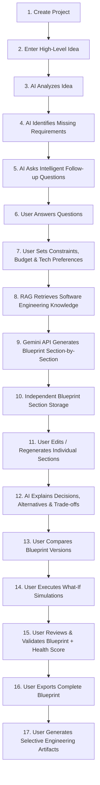

### Architectural Objective
Ensure that every output generated by the AI engine is traceable to proven engineering principles (via RAG), validated against rules, and structured as granular, versionable assets.

---

## 3. Core Philosophy

1. **Workflow over Chat:** AI is embedded as discrete pipeline processors triggered by lifecycle state transitions, rather than an unstructured chat window.
2. **Blueprint as Single Source of Truth (SSOT):** The normalized Blueprint document graph acts as the authoritative source for analysis, Health Scoring, What-if simulations, export, and artifact synthesis.
3. **Granular Independence:** Every blueprint section (e.g., API Design, Database Design, Security Strategy) exists as an independent entity with isolated state, versioning history, and regeneration scope.
4. **Explainable Architecture:** Every recommendation must be accompanied by explicit reasoning: *Why recommended*, *Benefits*, *Alternatives*, and *Trade-offs*.
5. **No Blind Code Generation:** The platform strictly produces structural, strategic, architectural, and visual engineering specifications.

---

## 4. Target Users

| User Persona | Key Needs | Primary Platform Value |
| :--- | :--- | :--- |
| **Solo Developers & Students** | Structural guidance, standard architectural patterns, tech stack recommendations. | Prevents oversight of security, DB schema flaws, and non-functional requirements. |
| **Freelancers & Consultants** | Rapid specification writing, client proposals, cost estimation, architecture specs. | Reduces prep time from days to minutes while ensuring professional rigor. |
| **Startup Founders (Tech & Non-Tech)** | Turning product vision into technical requirements, roadmap planning, risk assessment. | Translates business vision into an actionable engineering blueprint. |
| **Software Teams & Tech Leads** | Architecture sanity checks, trade-off analysis, standard visual diagrams, version comparison. | Standardizes architectural documentation and facilitates tech debt evaluation. |

---

## 5. Functional Scope (MVP Version 1.0)

The MVP functional scope is strictly bounded to high-impact planning capabilities:

```
[ArchitectIQ Workspace]
 ├── 1. Project Management (CRUD, Metadata, Lifecycle State)
 ├── 2. Interactive Requirements Intake (Idea Analysis, Gap Identification, Smart Questioning)
 ├── 3. Knowledge Ingestion & RAG Indexing (Standard Engineering Principles, Microservices/Monolith patterns)
 ├── 4. Modular Blueprint Generation Engine (23 Standard Sections)
 ├── 5. Sectional Editing & Isolated Regeneration
 ├── 6. Decision & Trade-off Explanation Engine
 ├── 7. Version Control & Version Diff Engine
 ├── 8. Architectural Health Scoring & Rule Validation
 ├── 9. What-If Simulation Engine (Scope, Scale, Tech Stack mutation analysis)
 ├── 10. Selective Engineering Artifact Generator (Mermaid.js & PlantUML specs)
 └── 11. Multi-format Blueprint Exporter (Markdown / Document Package)
```

---

## 6. High-Level User Workflow

The platform lifecycle is managed through a state-machine workflow on the backend:

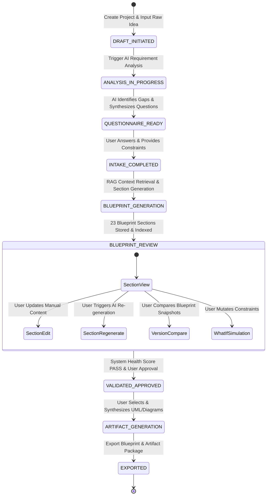

---

## 7. Complete System Architecture

ArchitectIQ is designed as a **Modular Layered Monolith with Async Pipeline Processing**. This pattern provides optimal operational simplicity, strict module isolation, high developer velocity, and low infrastructure overhead for the MVP, while leaving clear extension points for future microservice extraction if required.

```mermaid
graph TB
    subgraph Client_Layer [Client Layer - Single Page Application]
        UI[React + TypeScript + Tailwind CSS UI]
        MermaidRender[Mermaid.js Client Visualizer]
        PlantUMLRender[PlantUML Diagram Renderer]
        StateStore[Client State Store / React Context / Query]
    end

    subgraph API_Gateway_Security [API & Security Layer]
        FastAPI_GW[FastAPI Core Router & Middleware]
        JWTSecurity[JWT Auth & RBAC Middleware]
        RateLimiter[Rate Limiter & Input Sanitizer]
    end

    subgraph Business_Application_Layer [Business Logic & Service Layer]
        ProjService[Project Workspace Service]
        IntakeService[Intake & Questioning Engine]
        BlueprintService[Blueprint Orchestrator Service]
        ValidationService[Health Score & Rule Validator]
        SimService[What-If Simulation Engine]
        ArtifactService[Artifact Diagram Synthesizer]
    end

    subgraph AI_RAG_Subsystem [AI & RAG Orchestration Engine]
        PromptEngine[Structured Prompt Engineering Module]
        GeminiClient[Google Gemini API Client / Model Gateway]
        RAGRetriever[RAG Knowledge Retrieval Pipeline]
        VectorEngine[ChromaDB Vector Service]
    end

    subgraph Data_Storage_Layer [Persistence & Knowledge Layer]
        PostgreSQL[(PostgreSQL Relational DB)]
        ChromaStore[(ChromaDB Vector Storage)]
        KnowledgeBase[(Engineering Knowledge Base Corpus)]
    end

    %% Interactions
    UI <-->|HTTPS / REST / JSON| FastAPI_GW
    FastAPI_GW --> JWTSecurity
    JWTSecurity --> RateLimiter
    RateLimiter --> ProjService
    RateLimiter --> IntakeService
    RateLimiter --> BlueprintService
    RateLimiter --> ValidationService
    RateLimiter --> SimService
    RateLimiter --> ArtifactService

    BlueprintService <--> PromptEngine
    IntakeService <--> PromptEngine
    SimService <--> PromptEngine
    
    PromptEngine <--> RAGRetriever
    RAGRetriever <--> VectorEngine
    VectorEngine <--> ChromaStore
    KnowledgeBase -.->|Ingestion Pipeline| ChromaStore

    PromptEngine <--> GeminiClient
    GeminiClient <-->|Secure API Calls| ExternalGemini[Google Gemini API]

    ProjService <--> PostgreSQL
    BlueprintService <--> PostgreSQL
    ValidationService <--> PostgreSQL
    ArtifactService <--> PostgreSQL
```

### Architectural Decision: Modular Monolith vs. Microservices

| Criteria | Selected Approach: Modular Monolith | Alternative: Distributed Microservices | Justification |
| :--- | :--- | :--- | :--- |
| **Why Recommended** | Single FastAPI codebase divided into domain-bounded modules (`projects`, `blueprints`, `rag`, `artifacts`) communicating via python interfaces. | Network-isolated services (e.g., Auth Service, Blueprint Service, RAG Service). | Eliminates network serialization overhead, complex distributed tracing, and multi-repo operational friction for MVP. |
| **Benefits** | Fast iteration, transactional consistency, single deployment pipeline, simple local development. | Independent scaling of specific services. | High developer productivity for MVP with zero unnecessary infrastructure complexity. |
| **Trade-offs** | Scaling requires scaling the entire backend container instance. | Adds distributed transaction complexity, network latency, and deployment overhead. | Acceptable trade-off because LLM API calls dominate latency, not CPU/Memory bounded service operations. |

---

## 8. Major System Components

### 8.1 Frontend Presentation Tier
- **Technologies:** React 18, TypeScript, Tailwind CSS, Lucide Icons.
- **Role:** Interactive user workspace, section-by-section view/edit canvas, interactive diff viewer, visual diagram renderer.
- **Client-Side Visualizers:** 
  - **Mermaid.js Integration:** Client-side parsing and SVG rendering of system architecture, sequence, and flow diagrams.
  - **PlantUML Client Adapter:** Encapsulates PlantUML DSL strings and fetches rendered vector SVGs from PlantUML server or local web worker assembly.

### 8.2 Backend Application Tier
- **Technologies:** Python 3.11+, FastAPI, Pydantic v2, SQLAlchemy (Async I/O), Alembic.
- **Role:** RESTful API provider, workflow state coordinator, schema validation, business rule execution, security enforcement.

### 8.3 AI & RAG Subsystem
- **Technologies:** Google Gemini API (`gemini-1.5-pro` / `gemini-1.5-flash`), ChromaDB (Vector Database), Sentence Transformers / Gemini Embeddings.
- **Role:** High-level idea analysis, intelligent gap detection, context retrieval from trusted engineering corpora, section generation, explainability generation, and what-if simulation evaluation.

### 8.4 Database & Persistence Tier
- **Technologies:** PostgreSQL 15+, ChromaDB local persistence.
- **Role:** Long-term relational storage for projects, blueprint JSON structures, version trees, audit logs, user sessions, and vector embedding indices.

---

## 9. Responsibilities of Each Module

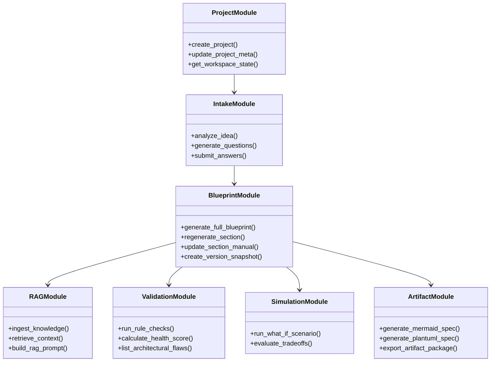

### Module Boundary Responsibility Matrix

1. **Project Management Module:** Manages project metadata, workspace state transitions, ownership, and user authorization boundaries.
2. **Intake & Questioning Module:** Parses raw idea text, interacts with LLM to find missing domain requirements, builds dynamic questionnaires, and collects user constraints.
3. **RAG & Knowledge Module:** Maintains the local ChromaDB vector repository of curated software architecture patterns, non-functional requirements baselines, and cost/complexity heuristics. Performs hybrid search queries.
4. **Blueprint Generation Module:** Orchestrates multi-step generation of all 23 blueprint sections. Coordinates independent section storage, edits, and regeneration requests.
5. **Validation & Health Score Module:** Executes static heuristic rules (e.g., checking if authentication strategy matches API design choices) combined with LLM consistency checks to produce an overall Architectural Health Score (0–100).
6. **Simulation Module (What-If Engine):** Computes delta analysis when key constraints change (e.g., "Change database from PostgreSQL to DynamoDB" or "Increase concurrent users from 1,000 to 1,000,000").
7. **Artifact Generation Module:** Transforms structured blueprint JSON data into formal Mermaid.js and PlantUML DSL representations for architecture, sequence, database ER, component, and deployment diagrams.

---

## 10. Backend Module Architecture

The FastAPI backend uses a domain-driven, layer-isolated file and package layout to guarantee clean code separation:

```
app/
 ├── core/
 │    ├── config.py             # System settings, Environment Variables, LLM Config
 │    ├── security.py           # JWT token generation, password hashing, OAuth2 schemes
 │    ├── exceptions.py         # Custom application exception definitions
 │    └── logging.py            # Structured JSON logger configuration
 ├── db/
 │    ├── base.py               # SQLAlchemy async base metadata
 │    ├── session.py            # Async engine & sessionmaker factory
 │    └── vector_db.py          # ChromaDB client initialization & collection accessors
 ├── modules/
 │    ├── projects/             # Workspace & Project Management Domain
 │    │    ├── models.py        # SQLAlchemy ORM models
 │    │    ├── schemas.py       # Pydantic Request/Response DTOs
 │    │    ├── router.py        # FastAPI API Endpoints definition
 │    │    └── service.py       # Core business logic methods
 │    ├── intake/               # Requirements Intake & Questioning Domain
 │    │    ├── schemas.py
 │    │    ├── router.py
 │    │    └── service.py
 │    ├── blueprints/           # Blueprint Orchestration & Section Management
 │    │    ├── models.py
 │    │    ├── schemas.py
 │    │    ├── router.py
 │    │    └── service.py
 │    ├── rag/                  # Vector Retrieval & Knowledge Base Ingestion
 │    │    ├── indexer.py
 │    │    ├── retriever.py
 │    │    └── service.py
 │    ├── ai_engine/            # Gemini API Client & Prompt Engineering Framework
 │    │    ├── client.py
 │    │    ├── prompts.py
 │    │    └── parsers.py
 │    ├── validation/           # Architectural Health Scoring & Rule Checks
 │    │    ├── rules.py
 │    │    └── validator.py
 │    ├── simulation/           # What-If Simulation Engine
 │    │    ├── evaluator.py
 │    │    └── service.py
 │    └── artifacts/            # UML & Mermaid Diagram Synthesizer
 │         ├── mermaid_gen.py
 │         ├── plantuml_gen.py
 │         └── service.py
 └── main.py                    # Application entrypoint & middleware mounting
```

### Data Access & Isolation Rules
- **No Direct DB Access from Routers:** API routers only communicate with Service classes.
- **DTO Isolation:** Database ORM models are never directly exposed to HTTP clients; Pydantic schemas enforce input/output contracts.
- **AI Service Abstraction:** AI client wrappers isolation ensures that swapping underlying LLM model versions (e.g., upgrading from Gemini 1.5 Flash to Gemini 2.0 Pro) requires zero changes to core business logic.

---

## 11. AI Workflow

ArchitectIQ's AI Workflow replaces conversational chat with **Structured Prompt Engineering & Deterministic JSON Output Enforcement**.

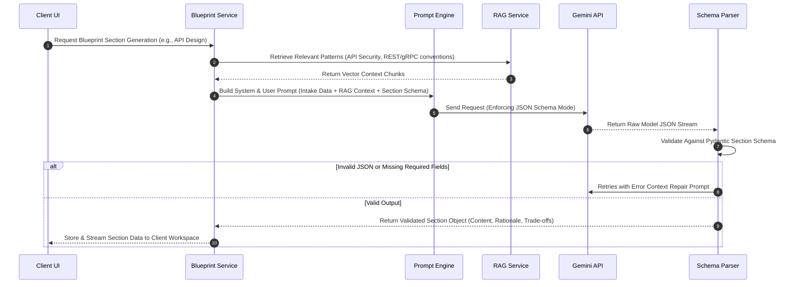

### Prompt Architecture & Context Management
1. **System Persona Injection:** Sets the AI role explicitly: *"You are an elite Principal Software Architect. Your task is to output rigorous, production-grade, unbiased architectural choices with trade-off explanations."*
2. **Context Budgeting:** Prompts are structured to maintain strict token usage efficiency:
   - System Instruction: 500 tokens
   - Project Intake Context: 1,500 tokens
   - RAG Grounding Context: 2,000 tokens
   - Target Section Schema Specification: 1,000 tokens
3. **Structured Response Guarantees:** Utilizes Gemini's native `response_mime_type="application/json"` and Pydantic schema constraints to eliminate markdown commentary wrapping or invalid payload structures.

---

## 12. RAG Workflow

The Retrieval-Augmented Generation subsystem grounds Gemini's reasoning in verified software engineering practices, preventing architectural hallucinations.

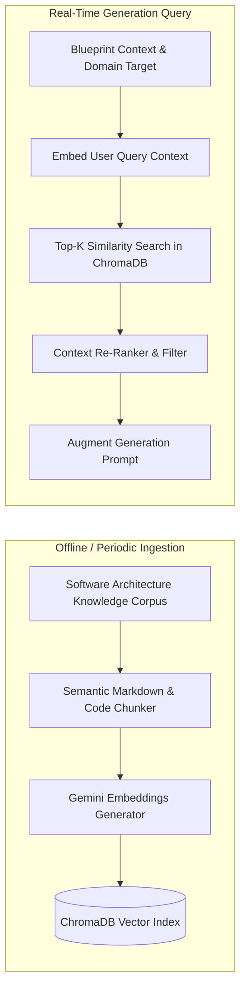
### Knowledge Ingestion Pipeline

Trusted software engineering resources are periodically collected, validated, and processed through the knowledge ingestion pipeline before being indexed into the vector database. This ensures the RAG system uses up-to-date and reliable engineering knowledge.

### Detailed RAG Pipeline Architecture
1. **Knowledge Corpus Strategy:** The knowledge base comprises curated documentation covering:
   - Modern System Design Patterns (CQRS, Event Sourcing, Layered Monolith, Microservices).
   - Database Selection Matrices (Relational vs Document vs Key-Value vs Graph vs Vector).
   - Security Standards (OWASP Top 10, JWT RFC 7519, OAuth 2.0, Zero Trust).
   - Cloud Infrastructure & Cost Estimation models.
2. **Chunking & Indexing:** Documents are split using semantic headers into 500-token chunks with 50-token overlaps. Metadata attributes (`category`, `pattern_type`, `tech_stack`) are attached to each vector.
3. **Retrieval Strategy:** Top-$K$ ($K=5$) nearest neighbors are retrieved via Cosine Similarity. Context is dynamically injected into the section prompt to enforce best practices (e.g., mandating token expiration and refresh logic when generating Authentication Strategy).

---

## 13. Blueprint Generation Workflow

The platform generates a complete 23-section blueprint section-by-section.

```
[Blueprint Document Graph]
 ├── Section 1: Executive Summary
 ├── Section 2: Problem Statement
 ├── Section 3: Objectives
 ├── Section 4: User Personas & Roles
 ├── Section 5: Functional Requirements
 ├── Section 6: Non-Functional Requirements
 ├── Section 7: User Stories
 ├── Section 8: Recommended Technology Stack
 ├── Section 9: Database Design
 ├── Section 10: API Design
 ├── Section 11: Folder Structure
 ├── Section 12: System Architecture
 ├── Section 13: Authentication Strategy
 ├── Section 14: Security Recommendations
 ├── Section 15: Deployment Strategy
 ├── Section 16: Infrastructure Recommendations
 ├── Section 17: Cost Estimation
 ├── Section 18: Development Roadmap
 ├── Section 19: Risk Analysis
 ├── Section 20: Scalability Considerations
 ├── Section 21: Health Score
 ├── Section 22: Engineering Decisions
 └── Section 23: Alternatives & Trade-offs
```

### Isolated Section Generation & Regeneration Pipeline
- **Section Independence:** Each section is generated as an individual transaction.
- **Dependency Flow:** Downstream sections read upstream sections as context. For example, generating *API Design* (Section 10) takes *Functional Requirements* (Section 5) and *Database Design* (Section 9) as input context.
- **Targeted Regeneration:** When a user regenerates Section 10 (*API Design*), only Section 10 is re-computed. Downstream sections are flagged with a `"STALE_DEPENDENCY_WARNING"` until the user re-validates or regenerates dependent sections.

---

## 14. Blueprint Validation Workflow

ArchitectIQ enforces high engineering quality using a dual-layer Architectural Validation Engine.

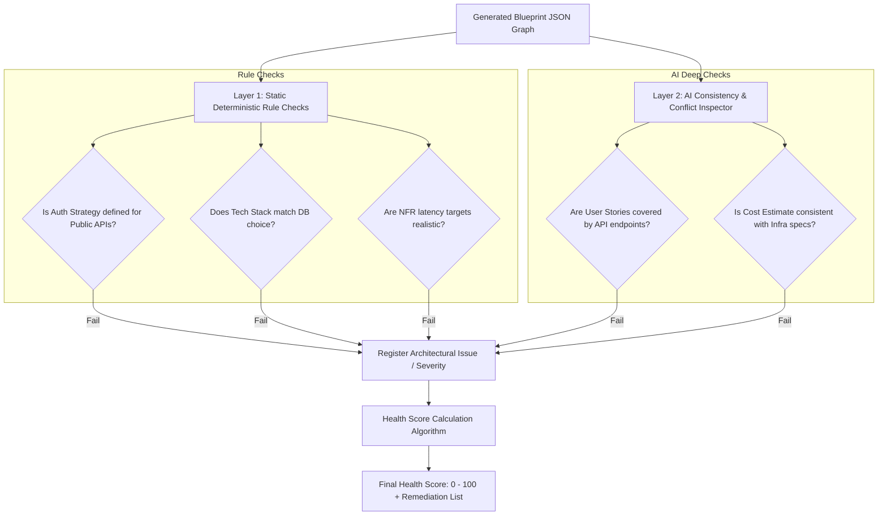

### Health Score Calculation Formula
The Architectural Health Score ($HS$) is computed as:
$$HS = \max\left(0, 100 - \sum_{i} (W_i \times N_i)\right)$$
Where:
- $W_i$: Severity Weight (Critical = 15, High = 10, Medium = 5, Low = 2)
- $N_i$: Count of unresolved architectural flaws in category $i$.

---

## 15. Engineering Artifact Generation Workflow

Once a blueprint achieves an acceptable Health Score and user approval, the Artifact Synthesis Engine transforms the structured blueprint JSON model into standard UML and architectural diagram code.

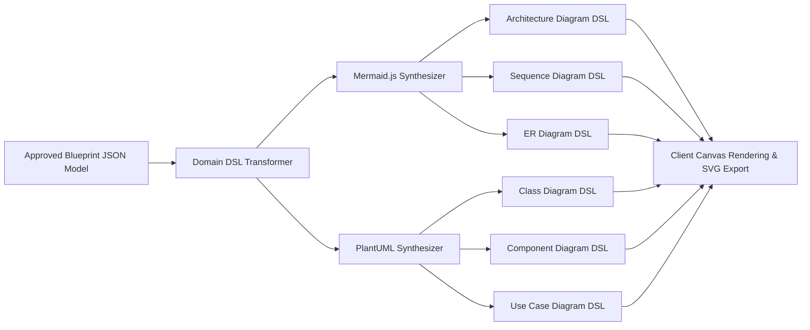

### Selective Generation Strategy
Users explicitly check which artifacts to generate (e.g., generating only ER Diagram and System Architecture Diagram). This saves LLM tokens, reduces processing time, and prevents UI clutter.

---

## 16. Data Flow Between Components

### End-to-End Intake & Generation Sequence

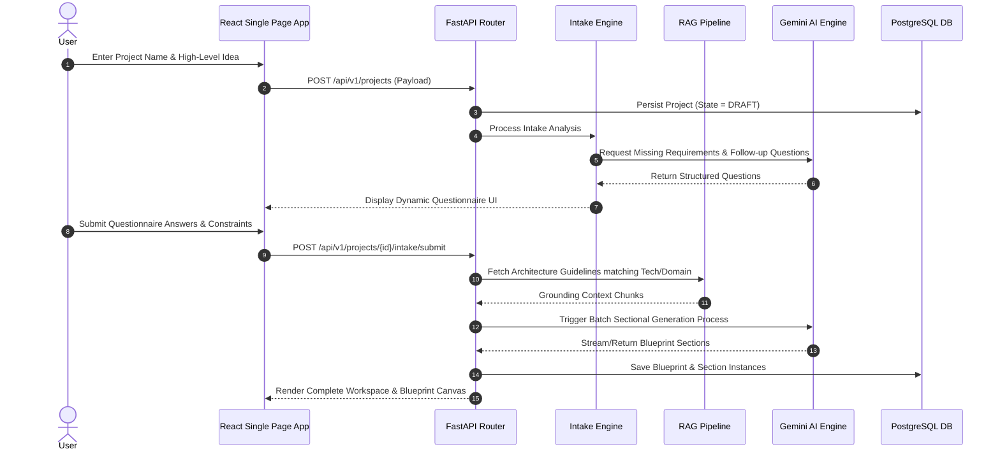

---

## 17. Storage Strategy

ArchitectIQ utilizes a hybrid storage architecture: PostgreSQL for structured relational and document data, and ChromaDB for vector similarity search.

```
+------------------------------------------------------------------+
|                      PostgreSQL Database                         |
+------------------------------------------------------------------+
|  users               : User Accounts, Credentials, Roles         |
|  projects            : Workspaces, Metadata, Lifecycle Status    |
|  project_intakes     : Ideas, Raw Answers, Budget, Constraints   |
|  blueprints          : Parent Blueprint Record, Health Score     |
|  blueprint_sections  : Section Code, Title, Content JSON, State  |
|  section_versions    : Revision Snapshots, Delta Diffs, Author   |
|  artifacts           : Diagram Code (Mermaid/PlantUML), Type     |
|  simulations         : Scenario Inputs, Trade-off Comparisons    |
+------------------------------------------------------------------+

+------------------------------------------------------------------+
|                   ChromaDB Vector Database                       |
+------------------------------------------------------------------+
|  collection: engineering_knowledge_base                         |
|    - Vector Embeddings (1536/768 dim)                            |
|    - Metadata: {category, pattern, title, source}               |
+------------------------------------------------------------------+
```

### Versioning & Delta Storage Strategy
- **Snapshot Storage:** Every explicit section edit or regeneration creates a immutable `section_versions` record storing the snapshot of the section content, creator ID, timestamp, and regeneration prompt.
- **Diff Computation:** Frontend and backend calculate line-by-line diffs using standard Myers diff algorithm to allow side-by-side version comparison in the UI.

---

## 18. Security Architecture

ArchitectIQ implements Security-by-Design across all architectural boundaries:

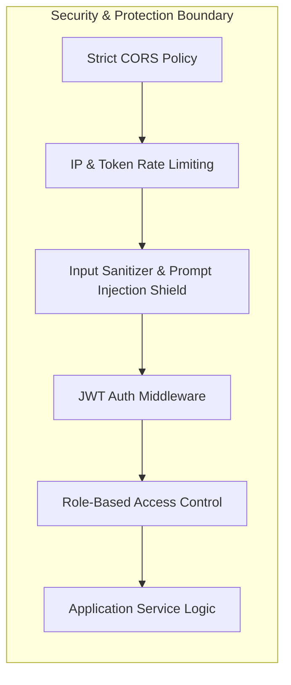

### Security Measures & Defensive Mechanisms
1. **Prompt Injection Mitigation:** User input entered into project descriptions or intake questionnaires is sanitized to escape delimiters, and passed strictly via system/user role parameters in Gemini API calls. User text is never concatenated into system prompt instructions.
2. **API Key Isolation:** Third-party AI API keys (Google Gemini API) are stored exclusively in backend environment secrets (`.env`) and managed via system environment variables. Keys are never exposed to the client.
3. **Data Isolation:** All database queries enforce strict tenant ownership isolation checks (`WHERE project.owner_id = current_user.id`).
4. **Transport & Storage Encryption:** HTTPS (TLS 1.3) enforced for all network transitions; database fields containing sensitive integration metadata are encrypted using AES-256 GCM.

---

## 19. Authentication & Authorization Flow

The platform relies on stateless JSON Web Token (JWT) authentication with short-lived Access Tokens and secure HTTP-Only Refresh Tokens.

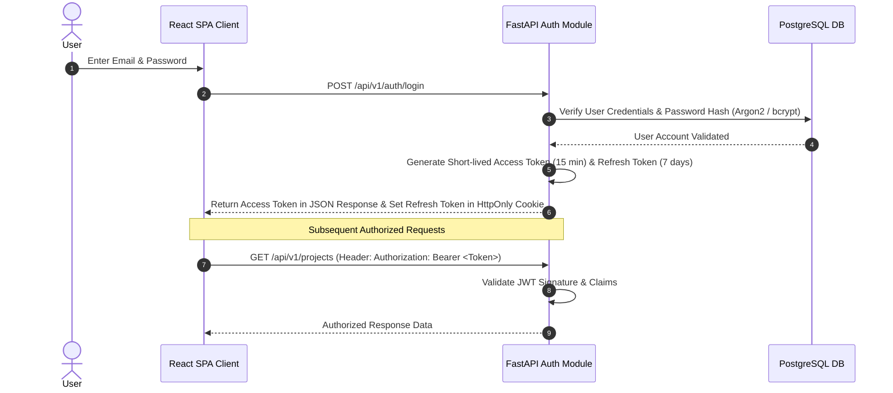

---

## 20. Scalability Strategy

While the MVP is designed as a Modular Monolith, its components are structured for effortless horizontal scaling:

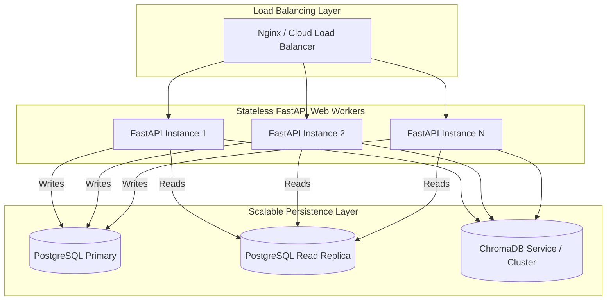

### Architectural Trade-off Analysis: Scalability

| Scalability Bottleneck | Mitigating Architectural Pattern | Performance / Cost Benefit |
| :--- | :--- | :--- |
| **LLM Call Blocking & Latency** | Asynchronous I/O (`async/await` in FastAPI) & Async Task queues for multi-section batch processing. | Web worker threads remain unblocked during HTTP calls to Gemini API. |
| **Database Connection Exhaustion** | SQLAlchemy Async Connection Pooling (`asyncpg`) with max pool size boundaries. | Prevents DB connection crashes during traffic spikes. |
| **Repeated Knowledge Queries** | In-memory caching (Redis / Cachetools) for vector embedding retrievals of static engineering rules. | Cuts ChromaDB lookup latency by up to 80% for common tech stack queries. |

---

## 21. Future Scope

Post-MVP (Version 2.0+) enhancements are intentionally decoupled from the initial baseline:

1. **Real-time Collaborative Workspaces:** WebSocket-based multi-user live editing, cursor tracking, and inline architectural commenting (CRDT/Yjs integration).
2. **Git Repository & Code Sync Engine:** Exporting validated engineering blueprints directly to GitHub/GitLab as `ARCHITECT.md` specifications and automated issue backlogs.
3. **Automated Infrastructure-as-Code (IaC) Synthesis:** Generating Terraform, Pulumi, or AWS CloudFormation templates directly derived from the approved Infrastructure Recommendations section.
4. **Custom Enterprise Vector Knowledge Bases:** Allowing enterprise organizations to connect proprietary internal documentation and engineering standard guidelines to private ChromaDB instances.
5. **Admin Workspace:** A dedicated administrator portal for managing users, roles, engineering knowledge sources, prompt templates, system configuration, usage analytics, AI request monitoring, and overall platform health.
6. **Fine-Tuned Specialized Architect Models:** Fine-tuning specialized open weights models (e.g., CodeLlama, Mistral) for offline / air-gapped enterprise deployments.

---

## 22. Architectural Risks and Considerations

The table below outlines key technical risks, impact levels, and engineered mitigations:

| # | Risk Description | Risk Severity | Architectural Mitigation Strategy |
| :--- | :--- | :--- | :--- |
| **1** | **LLM Non-Determinism & Hallucinations** | **HIGH** | Strict Pydantic JSON schema parsing mode combined with RAG grounding in verified engineering corpora. Automatic retry loops for invalid JSON responses. |
| **2** | **Syntax Rendering Errors in Diagrams** | **MEDIUM** | Client-side validation of generated Mermaid/PlantUML DSL prior to DOM injection. Fallback parsing logic to display raw code block with error highlighting if render fails. |
| **3** | **Context Window Exceeded on Large Projects** | **MEDIUM** | Hierarchical prompt structuring; downstream sections only receive relevant summarized upstream context rather than the entire monolithic blueprint tree. |
| **4** | **API Rate Limits & Cost Spikes** | **HIGH** | Granular sectional generation (generate on-demand), client request throttling, response caching for identical intake prompts, and API usage quotas per user. |
| **5** | **Vector Database Staleness** | **LOW** | Automated metadata versioning in ChromaDB collections; scheduled background sync jobs to update engineering reference patterns. |

---

## Architectural Decision Summary & Approval

This Software Architecture Document (SAD) outlines a production-grade, highly modular, workflow-driven AI planning platform. ArchitectIQ avoids generic chatbot paradigms in favor of deterministic, sectionally versioned, explainable engineering blueprint synthesis.

**Architectural Sign-off:**  
- **Lead System Architect:** Approved for Phase 1 MVP Implementation.  
- **Core Technology Stack:** React, TypeScript, Tailwind CSS, FastAPI, PostgreSQL, ChromaDB, Gemini API, Mermaid.js, PlantUML.  
- **Execution Strategy:** Modular Layered Monolith adhering to Clean Architecture & SOLID principles.
